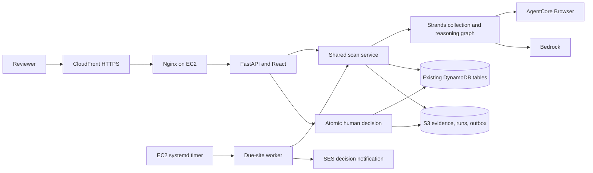

# Civic Canary upgrade plan

## Current state and gaps
Deployed per owner: CloudFront → Nginx → EC2 FastAPI/React → AgentCore Browser,
DynamoDB Sites/Findings/Reviews, S3. Optional Lambda/AgentCore Runtime code exists.
EC2 reasoning bypasses Strands; onboarding, notifications and EC2 scheduler are absent.

## Implementation order and exact components
1. `agent/civic_canary/models.py`, `browser.py`: additive target/setup/packet fields,
   public URL validation, multi-site extraction, preserved fixture adapter.
2. `agent/civic_canary/reasoning.py`, `services/runtime.py`, `agent/main.py`:
   one production Strands graph, collection tool, grounded structured decisions,
   traces and failure recording. Deterministic engine remains local-fixture only.
3. `services/storage.py`, `services/monitoring.py`, `services/notifications.py`:
   atomic reviews, bounded listing, persistent schedules/outbox using existing resources.
4. `services/control_api/app.py`, `web/src/api.ts`, `App.tsx`, `styles.css`:
   add/inspect/confirm websites, target selection, protected evidence/approved artifacts,
   before/after reviewer packet and traces.
5. `scripts/monitor_due.py`, `deploy/`: EC2 systemd timer and worker, role policy.
6. `tests/`, `scripts/evaluate.py`, README and demo checklist: regression/evaluation,
   deployed versus optional architecture, honest limits and AWS activation steps.

## Data/API contract
Existing IDs and tables stay. Targets gain objective, description, frequency, guidance,
recommended/confirmed sections and setup status. Findings gain grounded packet fields,
confidence, reviewer identity and notification status. Runs retain graph trace and output.
New protected POST /api/targets, POST /api/targets/{id}/inspect,
POST /api/targets/{id}/confirm, artifact and evidence retrieval. Existing APIs remain.

## AWS changes (prepare, do not claim deployed)
EC2 instance role needs Bedrock invocation, AgentCore Browser, S3 object/list,
DynamoDB transaction/conditional update access, and SES SendEmail for a verified sender.
No new DynamoDB tables. Enable systemd minute timer; per-site frequency controls due runs.
Set HTTPS public URL and verified sender/recipient; do not send real mail during tests.

## Security and reliability
Exact host, HTTPS, no credentials/private addresses, DNS checks at navigation boundaries,
read-only browser requests, bounded capture/graph and evidence excerpts. Untrusted website
text is data, never instructions. Validate all source quotes against captured evidence.
Authenticated artifact/evidence access. Atomic finding/review transaction with original
recommendation and evidence. S3 durable notification claim avoids automatic duplicate
sends; uncertain SES outcomes require reconciliation rather than unsafe blind retries.
No claims of mathematically exactly-once email or perfect semantic grounding.

## Test/evaluation plan
Two realistic layouts; no-change/noise/meaningful/ambiguous cases; duplicate changes;
failed baseline/browser/model; unsupported quotes; production graph execution;
notification suppression/duplicate/uncertain failure; atomic review; onboarding and UI.
Report deterministic/mock metrics separately from live-model quality. Review time requires
human measurement. Never manufacture evaluation results or deployed-resource evidence.

## Authoritative upgrade architecture

Systemd/SES are upgrade components requiring activation; not asserted already deployed.
Optional: EventBridge/Lambda/AgentCore Runtime invoke the same scan service.

## Demo verification
Add site → inspect/Strands section suggestions → confirm baseline → close dashboard →
timer run/no change/no email → change source → due run/Strands trace → one decision
notification → inspect before/after/evidence → approve → download artifact → audit.
Verify IAM, SES sender/recipient, public HTTPS link, timer logs, model/run trace and
artifacts in the real AWS account before recording the submission video.
