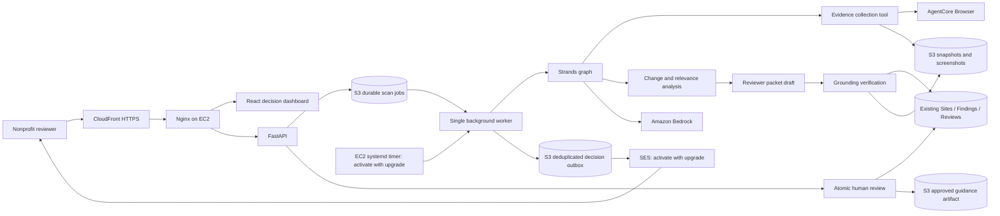

# Civic Canary

Civic Canary is a reviewer-controlled AI agent that monitors public-benefit portals for meaningful
content and accessibility regressions. It captures a safe, read-only snapshot, compares it with an
approved baseline, identifies nonprofit guidance affected by the change, and drafts a correction
for a human reviewer.

The repository contains a working local MVP and an AWS deployment hosted on Amazon EC2.

## Deployed AWS workflow

We built and deployed **Civic Canary**, an AWS-based monitoring system that detects meaningful
changes on public-benefit websites and turns those changes into actionable findings for nonprofit
teams. The application is hosted on **Amazon EC2** with a **FastAPI backend** and a **React
frontend served through Nginx**, while **Amazon CloudFront** provides the public HTTPS endpoint.
The monitored demo portal uses versioned pages such as V1 and V2 so the system can compare a known
baseline against an updated version. The EC2 instance uses an **IAM role** to securely access AWS
services without storing permanent access keys.

For automated website monitoring, Civic Canary uses **Amazon Bedrock AgentCore Browser** to launch
browser sessions and capture the monitored pages. The browser visits the portal through the
CloudFront HTTPS URL, captures page content and screenshots, and runs accessibility checks using
**axe-core**. The system successfully detected both a new policy requirement and an accessibility
issue: a newly required “Current benefit award letter” and a form field without an accessible
label. The application also uses **Amazon Bedrock** and the project's AI/agent workflow to analyze
detected changes, determine materiality and severity, map them to affected playbook sections, and
generate proposed remediation text.

For persistent storage, the application connects to **Amazon DynamoDB** and **Amazon S3**.
`CivicCanarySites` stores monitored-site configuration, `CivicCanaryFindings` stores structured
findings, and `CivicCanaryReviews` supports the human approval/rejection workflow. **Amazon S3**
stores the nonprofit playbook, scan records, baselines, snapshots, screenshots, evidence, and
AgentCore Browser recordings. We verified that successful scans return `200 OK`, AgentCore Browser
sessions are running, findings are written to DynamoDB, and supporting evidence is stored in S3.
This provides an end-to-end AWS workflow:

**Website monitoring → browser capture → AI analysis → evidence storage → structured findings →
human review.**

## Demo scenario

The included River County benefits portal has two deterministic versions:

- **V1** is the trusted baseline.
- **V2** adds a required benefit-award letter, breaks the Spanish guidance link, and removes a form
  label.
- Unrelated styling changes are intentionally ignored.

A reviewer can switch the demo version, start a scan, inspect evidence and graph timings, and
approve or reject a proposed guidance patch. Approval creates a separate Markdown artifact; Civic
Canary never edits the source portal.

## Features

- Bounded Strands workflow with typed Pydantic contracts
- Deterministic semantic and structural comparison before model review
- Accessibility checks for broken links, missing labels, language metadata, and axe-core findings
- Evidence-backed mapping from portal changes to nonprofit playbook sections
- Reviewer-token protection for scans, demo controls, and decisions
- Run idempotency and finding deduplication
- Local fixture browser and managed AgentCore Browser adapters
- S3 evidence, DynamoDB records, CloudWatch tracing, and scheduled scans on AWS
- Read-only URL allow-listing with cross-host navigation and write-request blocking

## Safety boundaries

Civic Canary does not:

- log in to portals or bypass CAPTCHA challenges;
- enter or collect personal information;
- upload files, submit applications, or make eligibility decisions;
- navigate outside a target's exact host allow-list;
- publish corrections without human approval.

## Deployed architecture and monitoring upgrade

The deployed foundation reported by the owner is CloudFront, Nginx/React/FastAPI on
EC2, AgentCore Browser, Bedrock, the three existing DynamoDB tables and S3. This
upgrade adds a shared production Strands graph and an EC2 background worker. Activate
the worker and SES notifications using [DEPLOYMENT_UPGRADE.md](DEPLOYMENT_UPGRADE.md).
Those upgrade components have been implemented locally, not verified in the AWS account.



Production scans always execute `agent/civic_canary/reasoning.py`. The graph owns the
browser collection tool, classifies objective-relevant changes, drafts a grounded
packet, and verifies its claims. Exact evidence quotations and current-guidance quotes
are validated before saving findings. The UI displays that validated proposed patch.
Model/browser failure records a failed run; there is no production deterministic bypass.
The deterministic V1/V2 fixture engine remains available in local mode.

**Optional architecture:** EventBridge, Lambda, API Gateway and AgentCore Runtime
remain in the repository as an alternative deployment. They are not represented as
active EC2 components. The optional Runtime entrypoint now shares the production scan
service. Do not deploy both scheduling paths without designing cross-worker locking.

## Add a website and review a decision

1. Enter your reviewer token and choose **Connect / refresh**.
2. Choose **Add Website**. Supply its HTTPS URL, name, objective, category, frequency,
   and optional guidance. The exact submitted page is monitored, not an unlimited crawl.
3. The background worker runs AgentCore Browser and Strands, stores the first baseline,
   and recommends headings based on captured evidence. Refresh to see setup progress.
4. Accept or edit the sections and choose **Confirm monitoring**.
5. Close the dashboard. The EC2 timer checks each site's due time. No material change
   means no notification. A new actionable finding creates a deduplicated outbox event.
6. Open the authenticated decision link. Review what changed, before/after evidence,
   impact, affected people, current/proposed guidance, severity and agent confidence.
7. Approve or reject with notes. Approval produces a downloadable Markdown artifact;
   it never edits a public website automatically. The audit record retains the original
   recommendation, evidence references, timestamp, reviewer identity and run ID.

Run detail shows the reasoning engine, model ID, graph node timings and notification
status. Browser session logs include that same run ID. Agent confidence is self-assessed,
not calibrated accuracy. All AWS-mode data/evidence reads require the reviewer token.

## Evaluation and submission evidence

```bash
uv run python -m scripts.evaluate --output evaluation-results.json
# Optional: uses real Bedrock calls against fixed HTML cases and incurs AWS usage.
uv run python -m scripts.evaluate --live-model --output live-evaluation-results.json
```

The offline suite checks two different page structures, meaningful/irrelevant/no-change
content, ambiguous changes, deduplication, SSRF rejection, model/browser failures,
notification behavior and atomic review. It also exercises the actual Strands SDK graph
with a mocked model transport. Offline pass rates are contract checks, not model accuracy
or live AWS uptime. Real-model accuracy and human review time remain unmeasured until
those evaluations are run. Follow [DEMO_CHECKLIST.md](DEMO_CHECKLIST.md) before submission.

## Repository layout

| Path | Purpose |
| --- | --- |
| `agent/` | Strands graph, comparison engine, browser adapters, schemas, and fixtures |
| `services/` | FastAPI control plane, scan worker, persistence, security, and observability |
| `web/` | React reviewer dashboard and deterministic portal fixtures |
| `infra/` | AWS CDK stack and AgentCore runtime policy |
| `agentcore/` | AgentCore project configuration |
| `scripts/` | Build, seed, deploy, and runtime-connection helpers |
| `tests/` | API, workflow, safety, and resilience tests |
| `AWS_DEPLOYMENT.md` | Complete deployment-owner handoff |

## Local quick start

Requirements:

- Python 3.13 or 3.14
- [`uv`](https://docs.astral.sh/uv/)
- Node.js 20, 22, or 24 and npm

Install dependencies:

```bash
uv sync --extra dev --extra infra
npm --prefix web install
cp .env.example .env
```

Start the API:

```bash
export REVIEW_TOKEN=review-demo
uv run uvicorn services.control_api.app:app --reload --port 8000
```

Start the reviewer UI in another terminal:

```bash
npm --prefix web run dev
```

Open `http://localhost:5173`, enter `review-demo`, switch the portal to V2, and choose **Run
scan**. The API is proxied from Vite to `http://localhost:8000`.

For a command-line demonstration:

```bash
uv run civic-canary --version v1
uv run civic-canary --version v2
```

V1 should produce no findings. V2 should detect the document requirement, broken Spanish link,
and unlabeled field.

## Run with Amazon Bedrock AgentCore Browser

To run Civic Canary using the managed Amazon Bedrock AgentCore Browser rather than the local fixture browser, create or update your local `.env` file with:

```bash
AWS_REGION=us-east-1
BROWSER_MODE=agentcore
AGENTCORE_BROWSER_ID=<their-browser-tool-id>
BEDROCK_MODEL_ID=<their-bedrock-model-or-inference-profile-id>
```

AWS credentials should come from the normal AWS credential chain / IAM role (such as `aws sso login` or environment credentials) and must not be committed to GitHub.

Run the scan locally in AgentCore mode:

```bash
uv run civic-canary --version v2 --browser-mode agentcore
```

When `BROWSER_MODE=agentcore` is set in `.env`, `uv run civic-canary --version v2` automatically connects to the configured AgentCore Browser tool.


## Tests and quality checks

```bash
uv run --extra dev pytest
uv run --extra dev ruff check agent services tests scripts infra
npm --prefix web test
npm --prefix web run lint
npm --prefix web run build
```

The tests cover baseline matching, all three demo regressions, allow-list enforcement, write-request
blocking, protected actions, approval rollback, asynchronous dispatch, idempotency, and explicit
failure handling.

## API

Reads (public in local fixture mode; reviewer-token protected in AWS mode):

- `GET /api/health`
- `GET /api/targets`
- `GET /api/runs`
- `GET /api/runs/{run_id}`
- `GET /api/findings`
- `GET /api/findings/{finding_id}`

Requests requiring `X-Review-Token`:

- `POST /api/runs`
- `POST /api/demo/version`
- `POST /api/findings/{finding_id}/decision`

## AWS deployment

For the existing CivicCanarySites, CivicCanaryFindings, CivicCanaryReviews tables and
civic-canary bucket, follow [Existing AWS storage](EXISTING_AWS_STORAGE.md).
That path needs no new tables or CDK deployment.

The optional CDK deployment targets `us-east-1`. Its Lambda/API Gateway/Runtime path is
separate from the EC2 deployment described above.

For the optional CDK deployment, follow [AWS_DEPLOYMENT.md](AWS_DEPLOYMENT.md). It includes the required
permissions, model and quota checks, reviewer-token setup, estimated costs, deployment commands,
acceptance tests, troubleshooting, and complete cleanup instructions.

Never commit `.env`, reviewer tokens, token digests, AWS credentials, generated deployment targets,
CDK output, packaged ZIP files, or local AgentCore state. These are excluded by `.gitignore`.

## Contributing

1. Create a branch from `main`.
2. Keep portal access read-only and preserve the safety boundaries above.
3. Add tests for every behavior change.
4. Run all Python and web checks before opening a pull request.

## License

This project is licensed under the [MIT License](LICENSE).

## Existing AWS storage and EC2 redeployment

Use [DEPLOYMENT_UPGRADE.md](DEPLOYMENT_UPGRADE.md) for the authoritative EC2 activation
steps, environment variables, role permissions, SES setup, timer installation, history
backfill and migration limits. No new DynamoDB tables are required. The existing
storage adapter remains compatible; new API decisions use atomic finding/review writes.

Before updating any previously deployed CDK stack, retain its old storage resources:
legacy definitions used destructive removal policies. EC2 activation does not require CDK.
