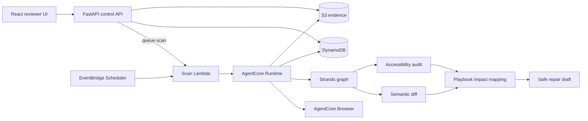

# Civic Canary

Civic Canary is a reviewer-controlled AI agent that monitors public-benefit portals for meaningful
content and accessibility regressions. It captures a safe, read-only snapshot, compares it with an
approved baseline, identifies nonprofit guidance affected by the change, and drafts a correction
for a human reviewer.

The repository contains a working local MVP and deployment-ready AWS infrastructure. No AWS
environment is currently deployed from this repository.

## Demo scenario

The included River County benefits portal has two deterministic versions:

- **V1** is the trusted baseline.
- **V2** adds a required benefit-award letter, breaks the Spanish guidance link, and removes a form
  label.
- Unrelated styling changes are intentionally ignored.

A reviewer can switch the demo version, start a scan, inspect evidence and graph timings, and
approve or reject a proposed guidance patch. Approval creates a separate Markdown artifact; Civic
Canary never edits the source portal.

## Features

- Bounded Strands workflow with typed Pydantic contracts
- Deterministic semantic and structural comparison before model review
- Accessibility checks for broken links, missing labels, language metadata, and axe-core findings
- Evidence-backed mapping from portal changes to nonprofit playbook sections
- Reviewer-token protection for scans, demo controls, and decisions
- Run idempotency and finding deduplication
- Local fixture browser and managed AgentCore Browser adapters
- S3 evidence, DynamoDB records, CloudWatch tracing, and scheduled scans on AWS
- Read-only URL allow-listing with cross-host navigation and write-request blocking

## Safety boundaries

Civic Canary does not:

- log in to portals or bypass CAPTCHA challenges;
- enter or collect personal information;
- upload files, submit applications, or make eligibility decisions;
- navigate outside a target's exact host allow-list;
- publish corrections without human approval.

## Architecture



Critical facts are extracted and compared deterministically. The model validates meaning and drafts
the correction, but malformed model output is never silently accepted. A failed scan is recorded as
a failed run and does not create an actionable finding.

## Repository layout

| Path | Purpose |
| --- | --- |
| `agent/` | Strands graph, comparison engine, browser adapters, schemas, and fixtures |
| `services/` | FastAPI control plane, scan worker, persistence, security, and observability |
| `web/` | React reviewer dashboard and deterministic portal fixtures |
| `infra/` | AWS CDK stack and AgentCore runtime policy |
| `agentcore/` | AgentCore project configuration |
| `scripts/` | Build, seed, deploy, and runtime-connection helpers |
| `tests/` | API, workflow, safety, and resilience tests |
| `AWS_DEPLOYMENT.md` | Complete deployment-owner handoff |

## Local quick start

Requirements:

- Python 3.13 or 3.14
- [`uv`](https://docs.astral.sh/uv/)
- Node.js 20, 22, or 24 and npm

Install dependencies:

```bash
uv sync --extra dev --extra infra
npm --prefix web install
cp .env.example .env
```

Start the API:

```bash
export REVIEW_TOKEN=review-demo
uv run uvicorn services.control_api.app:app --reload --port 8000
```

Start the reviewer UI in another terminal:

```bash
npm --prefix web run dev
```

Open `http://localhost:5173`, enter `review-demo`, switch the portal to V2, and choose **Run
scan**. The API is proxied from Vite to `http://localhost:8000`.

For a command-line demonstration:

```bash
uv run civic-canary --version v1
uv run civic-canary --version v2
```

V1 should produce no findings. V2 should detect the document requirement, broken Spanish link,
and unlabeled field.

## Tests and quality checks

```bash
uv run --extra dev pytest
uv run --extra dev ruff check agent services tests scripts infra
npm --prefix web test
npm --prefix web run lint
npm --prefix web run build
```

The tests cover baseline matching, all three demo regressions, allow-list enforcement, write-request
blocking, protected actions, approval rollback, asynchronous dispatch, idempotency, and explicit
failure handling.

## API

Public, sanitized reads:

- `GET /api/health`
- `GET /api/targets`
- `GET /api/runs`
- `GET /api/runs/{run_id}`
- `GET /api/findings`
- `GET /api/findings/{finding_id}`

Requests requiring `X-Review-Token`:

- `POST /api/runs`
- `POST /api/demo/version`
- `POST /api/findings/{finding_id}/decision`

## AWS deployment

For the existing CivicCanarySites, CivicCanaryFindings, CivicCanaryReviews tables and
civic-canary bucket, follow [Existing AWS storage](EXISTING_AWS_STORAGE.md).
That path needs no new tables or CDK deployment.

The production design targets `us-east-1` and uses Bedrock, AgentCore Runtime and Browser, Lambda,
API Gateway, DynamoDB, S3, Secrets Manager, Systems Manager Parameter Store, EventBridge Scheduler,
CloudWatch, IAM, and AWS Budgets.

The deployment owner should follow [AWS_DEPLOYMENT.md](AWS_DEPLOYMENT.md). It includes the required
permissions, model and quota checks, reviewer-token setup, estimated costs, deployment commands,
acceptance tests, troubleshooting, and complete cleanup instructions.

Never commit `.env`, reviewer tokens, token digests, AWS credentials, generated deployment targets,
CDK output, packaged ZIP files, or local AgentCore state. These are excluded by `.gitignore`.

## Contributing

1. Create a branch from `main`.
2. Keep portal access read-only and preserve the safety boundaries above.
3. Add tests for every behavior change.
4. Run all Python and web checks before opening a pull request.

## License

This project is licensed under the [MIT License](LICENSE).
