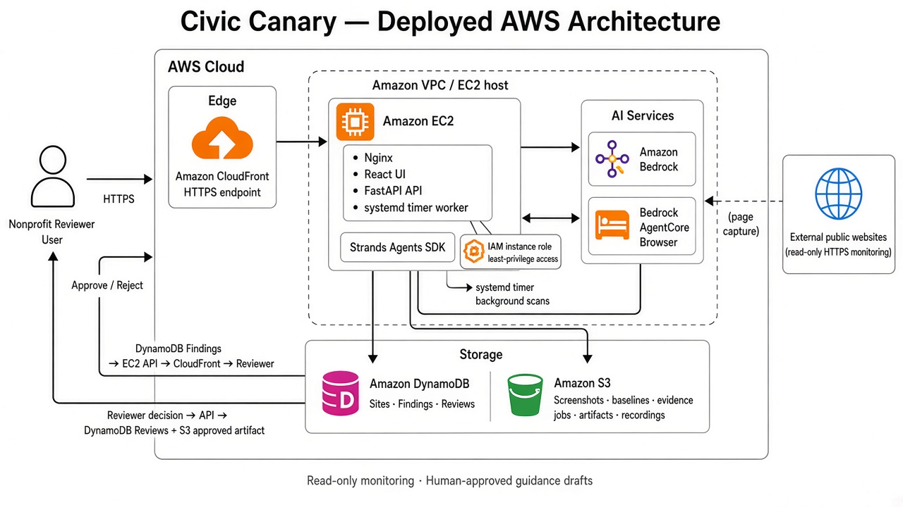

# Civic Canary

[Live HTTPS demo](https://d2g9z69nuvwc3l.cloudfront.net/) · [Submission packet](submission/SUBMISSION.md) · [MIT license](LICENSE)

Civic Canary is an autonomous AWS monitoring agent for public-benefit websites. It watches
read-only pages for meaningful content and accessibility changes, verifies findings with
evidence, and drafts guidance updates for a human reviewer—never publishing changes on its own.

**License:** [MIT](LICENSE) · Copyright (c) 2026 Rudra Bedekar

## The problem

Nonprofit teams rely on public portals for eligibility rules, required documents, and
application guidance. Those pages change without notice. Manual checking does not scale, and
raw website diffs are noisy. Civic Canary surfaces only material, evidence-backed changes that
affect people seeking benefits—and keeps a human in the loop before any guidance is updated.

## Architecture



Civic Canary runs as an autonomous monitoring agent on AWS. A background worker periodically
checks public-benefit websites, uses the Strands Agents SDK with Amazon Bedrock and AgentCore
Browser to detect and verify meaningful changes, stores findings and evidence in DynamoDB and
S3, and surfaces only actionable issues for human review.

**Core AWS services:** CloudFront, EC2, Strands Agents SDK, Amazon Bedrock, AgentCore Browser,
DynamoDB, and S3.

**High-level flow:** Reviewer → CloudFront → EC2 (UI, API, and worker) → Strands → Bedrock /
AgentCore Browser → public websites → S3 evidence and DynamoDB findings → human approve or
reject → review record and approved artifact in S3.

## Autonomous agent workflow

1. **Schedule** — An EC2 background worker checks which monitored sites are due.
2. **Capture** — AgentCore Browser opens the allow-listed HTTPS pages, collects content,
   screenshots, and accessibility signals.
3. **Analyze** — The Strands Agents SDK runs a bounded graph on Amazon Bedrock: collect
   evidence, classify relevant changes, draft a reviewer packet, and verify claims against
   captured sources.
4. **Persist** — Baselines, snapshots, screenshots, and scan records go to S3. Site config,
   findings, and review state go to DynamoDB.
5. **Review** — Only actionable findings appear in the dashboard for approve or reject.

## Human-in-the-loop review

Civic Canary drafts corrections; it does not edit public websites.

- Reviewers see what changed, before/after evidence, impact, severity, and proposed guidance.
- **Approve** writes an audit record and a downloadable Markdown artifact in S3.
- **Reject** records the decision without publishing anything.
- Scans, demo controls, and decisions require a reviewer token.

## Demo scenario

The included River County benefits portal has two versions:

- **V1** — trusted baseline
- **V2** — adds a required award letter, breaks Spanish guidance, and removes a form label
- Cosmetic styling changes are ignored

Reviewers can switch versions, run a scan, inspect evidence, and approve or reject a proposed
patch.

## What it does

- Monitors public HTTPS pages with a bounded, objective-guided page set
- Detects material content and accessibility regressions with evidence quotations
- Maps changes to nonprofit guidance sections and drafts remediation text
- Deduplicates findings and supports scheduled background scans on AWS
- Enforces read-only allow-lists (no login, no form submit, no off-host crawl)

## Safety boundaries

Civic Canary does **not**:

- log in, bypass CAPTCHA, or collect personal information
- upload files, submit applications, or make eligibility decisions
- navigate outside a target’s host allow-list
- publish corrections without human approval

## Quick start (local)

**Requirements:** Python 3.13+, [`uv`](https://docs.astral.sh/uv/), Node.js 20+

```bash
uv sync --extra dev
npm --prefix web install
cp .env.example .env

export REVIEW_TOKEN=review-demo
uv run uvicorn services.control_api.app:app --reload --port 8000
```

In another terminal:

```bash
npm --prefix web run dev
```

Open `http://localhost:5173`, enter `review-demo`, switch the portal to V2, and run a scan.

CLI demo:

```bash
uv run civic-canary --version v1   # expect no findings
uv run civic-canary --version v2   # expect material + accessibility findings
```

### AgentCore Browser (optional local)

```bash
AWS_REGION=us-east-1
BROWSER_MODE=agentcore
AGENTCORE_BROWSER_ID=<browser-id>
BEDROCK_MODEL_ID=<model-or-inference-profile-id>
```

```bash
uv run civic-canary --version v2 --browser-mode agentcore
```

Use the standard AWS credential chain or an IAM role. Never commit credentials or `.env`.

## Add a website (AWS deployment)

1. Connect with your reviewer token.
2. Add a public HTTPS URL, name, monitoring objective, and scan frequency.
3. Wait for baseline inspection (AgentCore Browser + Strands).
4. Confirm or edit the discovered pages and sections to monitor.
5. On later runs, the worker revisits those pages and opens findings only when material
   changes are verified.
6. Approve or reject each finding; approval produces a downloadable guidance artifact.

## Repository layout

| Path | Purpose |
| --- | --- |
| `agent/` | Strands workflow, browser adapters, schemas, fixtures |
| `services/` | FastAPI control plane, worker, storage, security |
| `web/` | React reviewer dashboard |
| `docs/` | Architecture diagram and deployment notes |
| `infra/` | Optional CDK definitions |
| `tests/` | API, workflow, and safety tests |

## Technical notes

Detailed deployment, IAM, storage layout, EC2 worker activation, evaluation, and optional CDK
paths live outside this overview:

- [docs/DEPLOYMENT.md](docs/DEPLOYMENT.md) — deployment index
- [DEPLOYMENT_UPGRADE.md](DEPLOYMENT_UPGRADE.md) — EC2 worker and storage upgrade
- [EXISTING_AWS_STORAGE.md](EXISTING_AWS_STORAGE.md) — existing DynamoDB/S3 layout
- [AWS_DEPLOYMENT.md](AWS_DEPLOYMENT.md) — optional CDK handoff
- [DEMO_CHECKLIST.md](DEMO_CHECKLIST.md) — demo and submission checklist

```bash
# Tests
uv run --extra dev pytest
uv run --extra dev ruff check agent services tests scripts infra
npm --prefix web test && npm --prefix web run lint && npm --prefix web run build

# Offline evaluation harness
uv run python -m scripts.evaluate --output evaluation-results.json
```

## License

This project is licensed under the [MIT License](LICENSE).  
Copyright (c) 2026 Rudra Bedekar.
